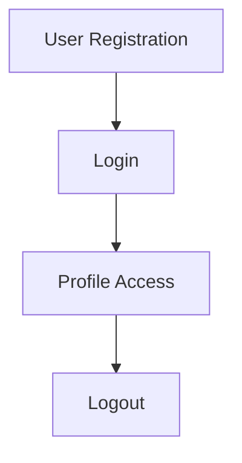
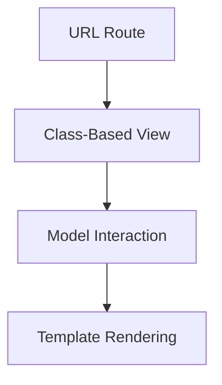

# Django Practice Projects

   

This repository contains various Django projects aimed at strengthening your understanding of Django development, from beginner to advanced topics. These projects cover a broad range of features like CRUD operations, session management, user authentication, and Django REST Framework (DRF).

## Table of Contents

1. [Introduction](#introduction)
2. [Projects Overview](#projects-overview)
   - [advtproject2](#advtproject2)
   - [authproject](#authproject)
   - [cbvproject](#cbvproject)
   - [fbvcrudproject](#fbvcrudproject)
   - [ormproject1](#ormproject1)
   - [movieproject](#movieproject)
3. [Visual Guide](#visual-guide)
4. [Notes and Documentation](#notes-and-documentation)
5. [Learning Path](#learning-path)
6. [Setup Instructions](#setup-instructions)
7. [Future Plans](#future-plans)
8. [Django REST Framework](#django-rest-framework)
9. [Contributing](#contributing)
10. [License](#license)

---

## Introduction

This repository serves as a hands-on learning resource for mastering Django development. It features projects of increasing complexity that highlight various Django topics, from models and views to Django REST Framework (DRF) and advanced concepts like middleware and session management.

---

## Projects Overview

| **Project**        | **Description**                                                  | **Key Concepts**                                          |
|--------------------|------------------------------------------------------------------|-----------------------------------------------------------|
| **advtproject2**    | Advanced template features and block tags.                       | Template inheritance, custom template tags.                |
| **authproject**     | User Authentication and Authorization system.                   | Login, logout, registration, permission handling.          |
| **cbvproject**      | CRUD operations using Class-Based Views (CBVs).                 | Introduction to CBVs, routing, and CRUD functionality.     |
| **fbvcrudproject**  | CRUD operations using Function-Based Views (FBVs).              | FBVs, CRUD implementation, custom routing.                 |
| **ormproject1**     | Using Django ORM to query databases.                            | Querysets, database relationships, custom managers.        |
| **movieproject**    | Movie Project using Django Model Forms.                         | Model forms, CRUD operations, form validation.             |

Each project folder is self-contained and includes detailed instructions on how to run it.

---

## Visual Guide

To better understand the flow of the key projects, visual aids such as flowcharts and diagrams are provided for clarity.

### **authproject** Flow Example



### **cbvproject** Structure Example



These visuals illustrate the core processes and architecture of the projects.

---

## Notes and Documentation

Extensive, detailed notes covering Django REST Framework and Django core concepts are available in the [Learning_Notes](https://github.com/Khushal-Savalakha/Learning_Notes) repository. These notes contain explanations for key topics, including the nuances of each project.

---

## Learning Path

The repository is structured to provide a comprehensive learning path for mastering Django:

1. **Django Fundamentals**:
   - Core concepts such as views, templates, and models.
2. **CRUD Operations**:
   - CRUD with Function-Based Views (FBVs) and Class-Based Views (CBVs).
3. **Forms and Validation**:
   - Form handling, validation techniques, and form customization.
4. **Authentication & Authorization**:
   - Secure authentication, permissions, and user handling.
5. **Session Management**:
   - Learning to manage user sessions in Django.
6. **Advanced Topics**:
   - JWT Authentication in Django REST Framework.
   - Middleware for custom request-response processing.
   - Optimizing database operations with Django ORM.

Once you’re comfortable with Django basics, you can dive deeper into Django REST Framework for building APIs, before moving on to Class-Based Views and CRUD operations.

---

## Setup Instructions

To set up any project, follow the steps below:

1. **Clone the repository**:
   ```bash
   git clone https://github.com/Khushal-Savalakha/Django-Practice-Projects.git
   cd Django-Practice-Projects
   ```

2. **Run the initial migrations**:
   ```bash
   python manage.py makemigrations
   ```

3. **Apply the migrations**:
   ```bash
   python manage.py migrate
   ```

4. **Run the development server**:
   ```bash
   python manage.py runserver
   ```

Each project includes further instructions in its respective folder.

---

## Future Plans

In the coming months, I plan to:

- Finalize **Session Management**.
- Explore **Middleware** and **Advanced Model Concepts** in Django.
- Develop a comprehensive **Blog Application** that incorporates CRUD operations, authentication, and other advanced Django concepts.

---

## Django REST Framework

To learn **Django REST Framework (DRF)**, visit the **[DjangoRESTFramework-PracticeRepo](https://github.com/Khushal-Savalakha/DjangoRESTFramework-PracticeRepo)** repository. It focuses on mastering DRF and building robust API services.

Key topics covered include:

- APIView
- Serializers and ModelSerializers
- Authentication and Permissions
- JWT Tokens
- Testing APIs

Before starting with DRF, it’s essential to have a solid understanding of basic Django concepts, until CRUD operations using Class-Based Views (CBVs). You should practice these concepts in this repository until commit **[  
d8051c7](https://github.com/Khushal-Savalakha/Django-Practice-Projects/commit/d8051c7926d5ed03710cd92aa8330a63debb260e)**, which focuses on CRUD operations using CBVs. This will give you a strong foundation for working with Django REST Framework.

Feel free to **request additional topics or features** you’d like to see covered in the DRF repository, and I’ll gladly add them based on the demand!

---

## Contributing

Contributions are always welcome! Feel free to fork the repository, create issues, or submit pull requests. Be sure to review the [contributing guidelines](CONTRIBUTING.md) before contributing.

---

## License

This project is licensed under the MIT License. See the [LICENSE](LICENSE) file for details.

