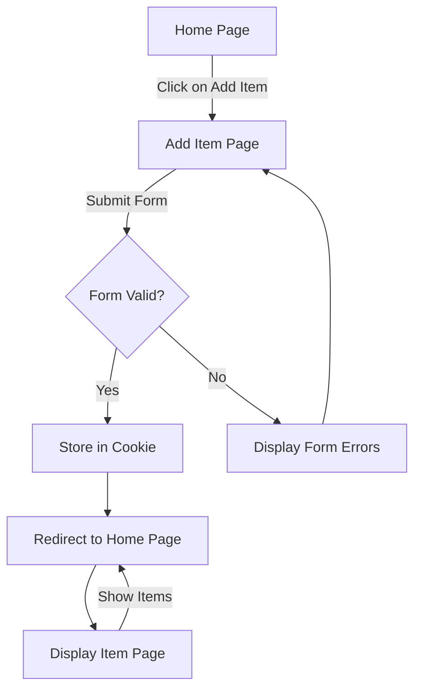

# Shopping App

An interactive Django application that allows users to add items with quantities and view them temporarily via cookies, with data persistence lasting for 60 seconds.

---

## 📑 Table of Contents
- [Overview](#overview)
- [Features](#features)
- [Demo Video](#demo-video)
- [Application Workflow](#application-workflow)
- [Screenshots](#screenshots)
- [Flowchart](#flowchart)
- [Additional Resources](#additional-resources)

---

## Overview
This Django app demonstrates a basic item management system, focusing on adding and displaying items with temporary storage in cookies.

### ⚙️ Technology Stack
- **Backend**: Django
- **Frontend**: HTML/CSS
- **Storage**: Cookies

## Features
- **Add Items**: Enter item names and quantities, stored temporarily.
- **View Items**: Display items stored in cookies.
- **Cookie Persistence**: Items are stored for 60 seconds.
---

## Demo Video

https://github.com/user-attachments/assets/6ebc0ed0-5aef-4a3d-a6ad-7810ecd51ff8
---

## Application Workflow

1. **Home Page**  
   The `index_view` function renders the home page, providing an entry point for users.

2. **Add Item Page**  
   - **View**: The `additems_view` function displays an `AddItemForm` for item input.
   - **Data Handling**: If the form is submitted via POST, item data (name and quantity) is validated and stored in a cookie, available for 60 seconds.
   - **Template**: `add_item.html` renders the form and displays a message upon successful addition.

3. **Display Items Page**  
   - The `displayitems_view` renders `display_items.html`, listing items retrieved from cookies.

---

## Screenshots

### 🏠 Home Page

### ➕ Add Item Page

### 📋 Display Items Page

---

## Flowchart

This flowchart visually represents the interaction between pages and data flow, including form handling and item storage in cookies.

---

## Additional Resources

- 📖 [Django Documentation](https://docs.djangoproject.com/)
- 🍪 [Managing Cookies in Django](https://docs.djangoproject.com/en/stable/topics/http/sessions/#using-cookies-directly)

--- 
